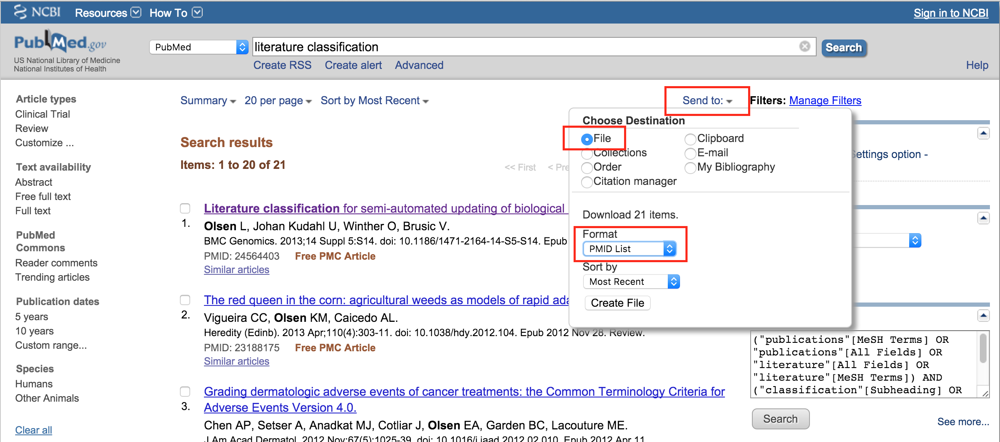
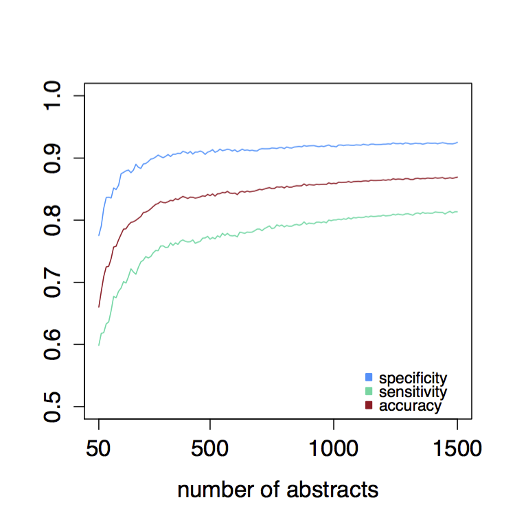
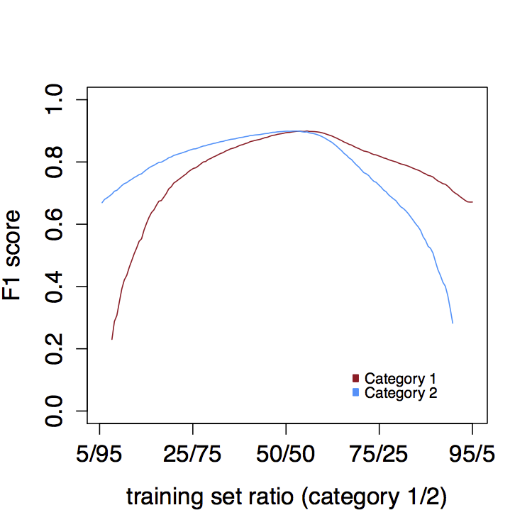

We have been using BioReader to successfully separate article corpora in the following use cases:

Example 1: Classifying articles by the presence or absence of flow cytometry data measuring the expression of surface proteins. For this project, we manually curated 508 articles and separated these into the two categories, one containing the desired information, and the other not containing the information. We then searched PubMed for articles to classify by searching for different cell types and proteins of interest, e.g. “T cell [AND] CD8”. For more information, see  [Barnkob MS, Simon C, Olsen LR: Characterizing the human hematopoietic CDome. Frontiers in Genetics, 2014](http://www.ncbi.nlm.nih.gov/pubmed/25309582).

Example 2: Classifying articles by the presence or absence of reported tumor specific T cell epitopes. For this project, we manually curated 512 articles (256 in each category) and used the resulting classifier to classify articles from which we extracted tumor T cell epitopes for the  [TANTIGEN database](http://cvc.dfci.harvard.edu/tadb/index.html). For more information, see  [Olsen LR, Kudahl UJ, Winther O, Brusic V: Literature classification for semi-automated updating of biological knowledgebases. BMC Genomics, 2013](http://www.ncbi.nlm.nih.gov/pubmed/24564403).

Example 3: Classifying articles by epitope-specific data or epitope structure. This data was used for the  [Immune Epitope Database](http://www.iedb.org/). Set 1 contains 1,000 abstracts for which the articles contain epitope-specific data or epitope and 1,000 abstracts not containing this information. For more information, see  [Vita R, Peters B, Sette A: The curation guidelines of the Immune Epitope Database and Analysis Resource. Cytometry A, 2008](http://www.ncbi.nlm.nih.gov/pubmed/18688821).
  

#### Input format

To use BioReader, you need two data sets:

1.  Training data: a corpus of curated articles, separated into (at least) two categories. These data can be submitted to BioReader as two lists of PubMed article IDs.
2.  Test data: A corpus of non-curated articles that you would like to have classified by the probability that they belong to one of the two training categories. This corpus can be submitted in two ways:  
    1.  As a list of PubMed IDs (like the training data), or
    2.  As a PubMed search term, or
    3.  As a combination of a PubMed search term and a list of PubMed IDs.
  

#### Preparing the data

Before using BioReader you must prepare your datasets. The training data must be manually curated and separated into (at least) two classes. For these articles, you must fetch PubMed IDs and copy/paste these into the relevant input box, separated by comma or a new line. Collecting these IDs as you curate your articles is by far the easiest approach, but they can be fetched after the curation using the  [Entrez Direct E-utilities](http://www.ncbi.nlm.nih.gov/books/NBK179288/). The abstracts to be classified can be collected by searching PubMed for articles and saving the PubMed IDs (Figure 1), or, they can be fetched by entering a PubMed search term directly in BioReader. Please note that due to NCBI limitations, it is currently only possible to enter 1000 abstracts in each training category and the test list. We are working on increasing this number.
  

<figure>

<i><figcaption>Figure 1: Saving PubMed IDs for a keyword search in PubMed.</figcaption></i>
</figure>

 

#### How to interpret results

The results page is divided into three main parts:

  

1.  Performance metrics given as  [precision, recall, and F score](https://en.wikipedia.org/wiki/Precision_and_recall). Additionally, an overview of the number of abstracts used for classification is printed, as not all abstracts can be retrieved (some are missing, some are in other languages than English, etc.).
2.  Two lists are printed (one for each category), in which the test data is separated based on category prediction. The article title links directly to the PubMed entry, and the lists can be sorted based on predicted rank (the higher the rank, the more confident the classification), publication year, and title. Holding down the shift button allows you to do a secondary sorting.
3.  Lastly, the top terms defining each category of the training data shown in word clouds. The size of the term corresponds to the frequency and the color indicates the p value of difference in frequency between the two categories (the more intense red, the lower the p value).
  

#### Tips and tricks for successful classification

The performance of BioReader depends heavily on the size of the training set, how well the training set captures the differences between classes, and the inherent ability of a given set to be separated into classes. We recommend  _at least_  20 manually curated abstracts in each category, and ideally more than 100. We conducted a test on two relatively homologous groups of abstracts – all within the field of immunology, but some containing epitope information, and others not. Iteratively training a classifier and slowly increasing the training set size, we found that a lot is gained when increasing from 50-250 abstracts, but beyond that, performance gain is minimal (Figure 2).

BioReader can help you distinguish between relevant and irrelevant literature - even in cases where it is not obvious upon first glance. In fact, the more similar your negative articles are to your positive, the better the results - “subtle differences” is our speciality, and you probably don’t really need BioReader's help to tell the difference between psychology papers and plant science papers.

<figure>

<i><figcaption>Figure 2: Learning curve for five-fold cross-validation with glmnet on corpora ranging from 50 to 1500 abstracts in intervals of 10 abstracts (average over 100 iterations).</figcaption></i>
</figure>

 

Similarly, it is essential that you keep the training set balanced (an equal number of abstracts in each training category). Ideally, a training sets will be in a 50/50 ratio between the two categories, since an over representation of either category will skew the classification. Adding more abstracts in one category will increase the recall of that category at the expense of the precision (Figure 3).

<figure>

<i><figcaption>Figure 3: F1 scores for category 1 and category 2 classification at varying proportions of training set size (total 750 abstracts) for each category in intervals of 10 abstracts (average over 100 iterations).</figcaption></i>
</figure>

 

Lastly, it is important that you only attempt to separate into two categories in each run. It is possible to further categorize resulting categories in an iterative manner, e.g. first classify on diseases categories, followed by an additional classification on, say, the host organism.
  

#### How BioReader works

Step 1. Abstract retrieval. The webserver offers a simple interface where users are prompted to upload three lists of PubMed IDs: two lists for the training categories (e.g. positive and negative for content of interest) as well as one PubMed search term for which abstracts will be classified, and/or a list of PubMed IDs corresponding to abstracts to be classified as belonging to one of the two groups. The abstracts are retrieved using NCBI’s Entrez programming utilities, E-utilities.

Step 2. Text pre-processing and corpus formation. Once abstracts are retrieved, the three text corpora are formed and the following operations are performed on the text: lowercase transformation, stop word removal, punctuation removal, word stemming, and whitespace stripping. As many gene names contain numeric characters, numbers are not removed. All of the above operations are performed using the “NLP” and “tm” packages for R.

Step 3. Document-term matrix formation and classifier training. After corpus formation, the texts are tokenized in document term matrices (DTM) and word counts are background corrected by term frequency-inverse document frequency (Tf-Idf) transformation (using the “tm” package for R). Terms in the DTMs are then reduced to the top 100 terms differentiating the two training classes, as determined by a Welch’s T test. The resulting training corpora DTMs are used to train and test ten different classification algorithms (support vector machine, elastic-net regularized generalized linear model, maximum entropy, scaled linear discriminant analysis, bagging, boosting, random forest, artificial neural network, decision tree, and naïve Bayes classifiers) available through the “RTextTools” and “e1071” (Naïve Bayes) packages for R. The best performing algorithm is determined by five-fold cross-validation on the training set and the documents to be classified are subsequently assigned one of the two classes using this algorithm.
  

#### Source code

BioReader is written in R with a Perl wrapper for fetching abstracts from PubMed. The source code for BioReader is available upon request. The script can be run from command line or within R, if you already have a set of abstracts downloaded.
  

#### FAQ

1.  Why are some of my PMIDs not fetched?  
    Abstracts are not always available through PubMed, and sometimes in other languages than English, which is the only language that we currently support.
2.  Why am I getting such poor performance?  
    Is your training set large enough? We recommend  _at least_  20 abstracts in each training class, but our experience tells us that 100+ abstracts in each class is needed for reasonable performance. Other sources of poor performance are poorly defined test sets (e.g. fetching abstracts using a very broad PubMed search term) or inherently fuzzy categories (e.g. trying to classify into categories that do not actually exist in the data).
3.  Why are all my abstracts classified as a single category?  
    Is your training set balanced (have equal number of abstracts in each training category)? Including too few samples in one category will lead to poor classification of this category, and in extremely cases, all test abstracts will be classified as belonging to the other category.
  

